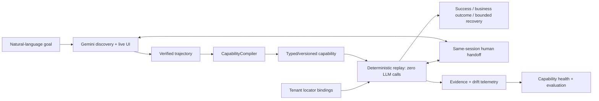

# AI-Bank: computer-use automation

**Discover once. Compile verified behavior. Replay without an LLM.**

Turn a natural-language member-balance goal into a reusable UI capability: real Gemini discovery observes and acts on a fictional banking application, verifies its trajectory, and passes it to CapabilityCompiler. The compiler produces a typed, versioned artifact; deterministic replay executes it with different inputs and **zero LLM calls**.

Replay checks identity and outcomes, uses bounded recovery, and stops safely for ambiguity or human intervention. Interactive discovery and replay share live-session handoff. Locator-only tenant bindings support reuse and drift detection; capability health summarizes the resulting evidence.

**Start here:** [assignment report](REPORT.md) · [5-minute evidence walkthrough](evidence/README.md) · [acceptance methodology](docs/acceptance.md)



## Setup and install

From the repository root, using Python 3.12 or newer:

```sh
python3 -m venv .venv
.venv/bin/python -m pip install -e '.[test]'
export PLAYWRIGHT_BROWSERS_PATH="$PWD/.playwright"
.venv/bin/python -m playwright install chromium
```

Set `PLAYWRIGHT_BROWSERS_PATH` in each new terminal that runs a browser command.

## Deterministic demo — no API key

```sh
.venv/bin/python examples/run_demo.py
```

This runs the original reviewed capability against local HTML and prints a result/evidence path. For the richer banking simulator and business outcomes, see [simulator commands](docs/simulator.md). To exercise live human takeover without Gemini:

```sh
.venv/bin/python examples/run_handoff.py
```

Open the **Operator panel** URL printed in the terminal. Take control, acknowledge the supervisor notice, and hand back; at the next pause, take control to confirm the fictional account opening and hand back again. The application runs headless; the panel displays its live state and audits supported actions.

## Real Gemini discovery

Put your key in an ignored root `.env` file:

```dotenv
GEMINI_API_KEY=<your-key>
GEMINI_MODEL=gemini-3.5-flash
```

```sh
.venv/bin/python examples/run_discovery.py \
  --goal 'Find member 48321 and retrieve their savings balance.'
```

The command starts its own local simulator and uses real Gemini decisions. It writes redacted evidence under `evidence/discovery/`. Provider errors, including quota exhaustion, are reported as failures; there is no mock fallback. Each run can make several model calls.

To demonstrate the complete unassisted discovery → compilation → different-input replay pipeline:

```sh
.venv/bin/python examples/discover_and_compile.py \
  --goal 'Find member 48321 and retrieve their savings balance.' \
  --member-id 48321 --validate-member-id 83921 --version 1.0.1
```

Use an unused version each time. Validation runs in a fresh process with model credentials removed and model imports blocked, then checks the missing-member business outcome. [Compiler details](docs/compiler.md).

## Discovery-time intervention

Open two terminals in the repository. In the first:

```sh
.venv/bin/python -m bank_simulator.server --port 8765
```

In the second:

```sh
PLAYWRIGHT_BROWSERS_PATH="$PWD/.playwright" .venv/bin/python examples/run_discovery.py \
  --interactive --url 'http://127.0.0.1:8765/?fault=UNEXPECTED_MODAL' \
  --goal 'Find member 48321 and retrieve their savings balance.'
```

Open the **Operator panel URL printed by discovery**, rather than the simulator URL. When paused, click **Take control → Acknowledge supervisor notice → Hand back to automation**. The same browser session stays alive, automation cannot act during HUMAN ownership, and fresh observation/member-identity checks gate resume. Discovery continues with a new model decision. The total deadline is 600 seconds by default.

The configured discovery action is notice acknowledgement; unsupported interventions remain paused for inspection/cancellation. `--non-interactive` returns HUMAN_REQUIRED and closes cleanly. `--headed` requires that mode. Successful human-assisted discovery retains evidence but is **not automatically compiled**: explicit review/approval would be required, and that approval workflow is not implemented. [Handoff details](docs/handoff.md).

## Acceptance and tests

```sh
# All normal tests, browser tests, type checks and controlled acceptance scenarios:
PLAYWRIGHT_BROWSERS_PATH="$PWD/.playwright" .venv/bin/python examples/run_acceptance.py

# Also attempt real Gemini discovery/compilation/isolated replay:
PLAYWRIGHT_BROWSERS_PATH="$PWD/.playwright" .venv/bin/python examples/run_acceptance.py --live-discovery

# Individual checks:
.venv/bin/python -m pytest -q
RUN_BROWSER_TESTS=1 PLAYWRIGHT_BROWSERS_PATH="$PWD/.playwright" .venv/bin/python -m pytest -q
.venv/bin/pyright
.venv/bin/python -m acceptance.privacy --repository --evidence evidence/acceptance
```

Acceptance writes new output under ignored `evidence/acceptance-local/`. Default acceptance labels live-provider claims as skipped; scripted model/operator tests are explicitly identified. Retained successful real Gemini runs are linked in the [evidence index](evidence/README.md); they do not guarantee future provider availability.

Latest live verification: [real Gemini retry evidence](evidence/acceptance/key-retry-20260914-1/README.md) passed discovery, compilation, different-input zero-model replay, and the missing-member business outcome. The earlier provider failure remains documented separately.

## Optional evaluation, reuse and health

```sh
.venv/bin/python examples/replay_tenant.py --all
.venv/bin/python examples/run_evaluation.py
.venv/bin/python examples/run_reliability_eval.py
```

These extensions use the same canonical capability without rediscovery. The evaluator tests 13 controlled scenarios: normal operation, locator/fallback failures, missing elements, stale state, partial loading, tenant drift, ambiguity, failed value retention, unexpected workspace, and missing-member business outcomes.

Retained evaluation results: **13/13 expected outcomes**, 46.2% completion including valid business outcomes, 91.3% primary locator success, 8.7% fallback usage, 40% fallback recovery, 46.2% unrecoverable failures, 7.7% human intervention, and 7 drift events. The most common failure is PAGE_STATE_INVALID. This deliberately adverse mix measures expected behavior under injected faults, not production reliability. Deterministic evaluation makes changes and safety stops repeatable without depending on a model's explanation. [Metrics and methodology](docs/evaluation.md).

## Scope and repository guide

Implemented: real browser discovery, narrow verified balance compilation, model-free replay, policy/checkpoints, audited same-session handoff, privacy-safe evidence, two tenant bindings, drift telemetry, local health and evaluation.

Deliberate limits: fictional local simulator; bounded mediated controls with no arbitrary native-browser takeover; no human-assisted compilation approval workflow; in-memory resume; desktop adapter is an abstraction only. Selective redaction requires a trusted simulator privacy contract and otherwise fails closed. There is no universal prompt-injection immunity, production reliability claim, durable orchestration, or automatic self-healing.

| Location | Purpose |
|---|---|
| [REPORT.md](REPORT.md) | Concise assignment design and cuts |
| [src/](src/) | Discovery, compiler, replay, simulator and supporting layers |
| [tests/](tests/) | Unit, boundary and opt-in browser verification |
| [examples/](examples/) | Runnable demos and acceptance commands |
| [capabilities/](capabilities/README.md) | Reviewed examples and immutable generated version |
| [tenant_bindings/](tenant_bindings/README.md) | Locator-only tenant configuration |
| [evidence/](evidence/README.md) | Curated claim-to-proof entry point |
| [docs/replay.md](docs/replay.md) | Replay internals, safety and result semantics |
| [docs/discovery.md](docs/discovery.md) | Model boundary and verified trajectories |
| [docs/health.md](docs/health.md) | Explainable reliability metrics and limits |
